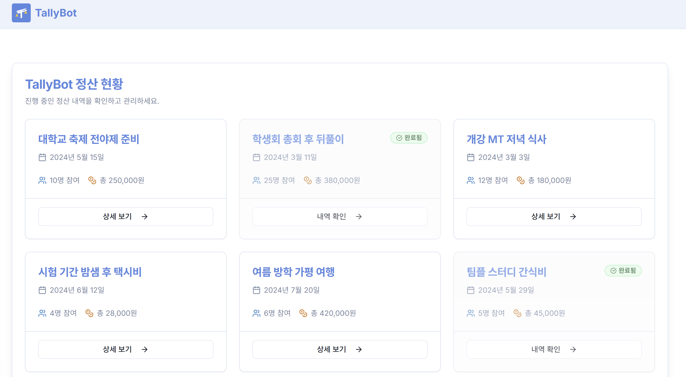
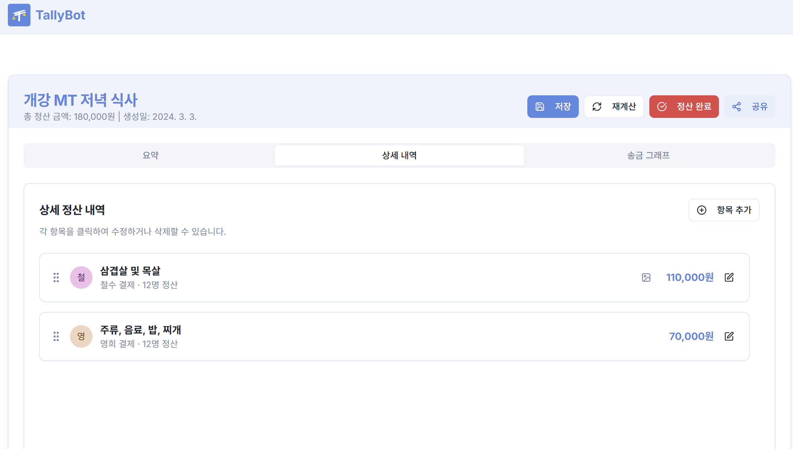
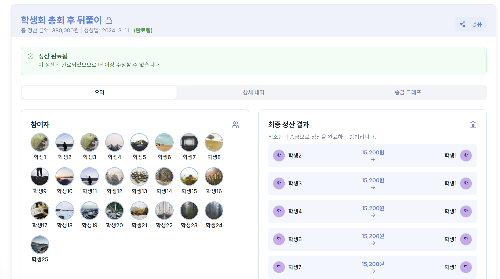
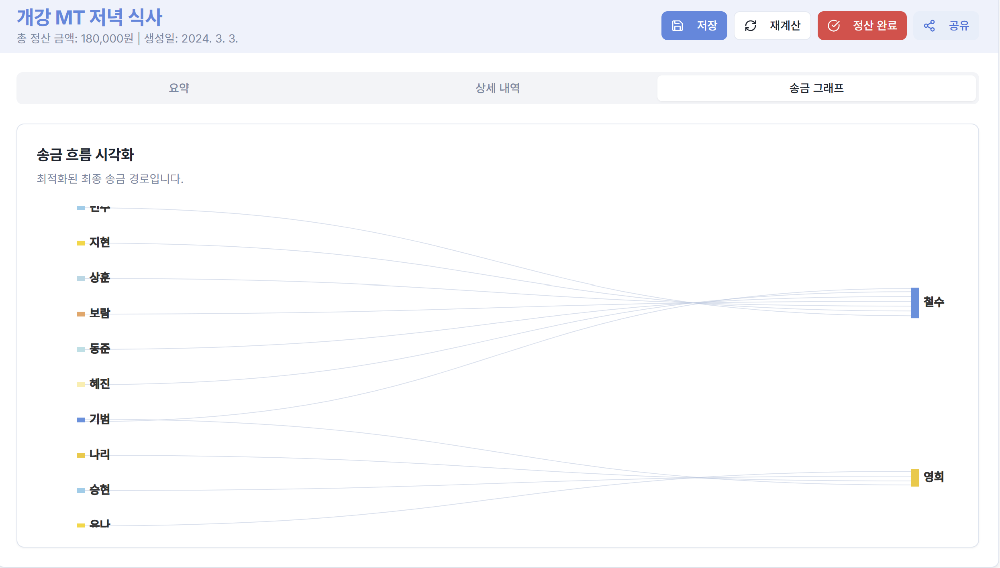

# TallyBot 웹 프론트엔드 v1

## 📖 프로젝트 소개
*   남궁재우 프로토타입

## 프로토타입 구동 화면

### 메인 화면


### 정산중 화면



### 정산완료 화면


### 정산 그래프 화면


## ✨ 주요 기능
*   **정산 요약**: 참여자별 총 지출 및 받을/보낼 금액 요약 정보를 제공합니다.
*   **상세 내역 관리**: 개별 결제 항목을 확인하고, 필요한 경우 금액, 참여자 등을 수정하거나 항목을 추가/삭제할 수 있습니다.
*   **송금 흐름 시각화**: 복잡한 정산 관계를 최소한의 송금 횟수로 해결하는 최적화된 송금 경로를 그래프 형태로 보여줍니다.
*   **실시간 업데이트 및 재계산**: 정산 항목 수정 시 변경사항을 저장하고, '재계산' 버튼을 통해 최적화된 송금 결과를 즉시 업데이트할 수 있습니다.
*   **공유 기능**: 생성된 정산 페이지 링크를 복사하여 다른 참여자들과 쉽게 공유할 수 있습니다.

## 🚀 시작하기

### 사전 요구사항
*   Node.js (v18 이상 권장)
*   npm 또는 yarn

### 설치 및 실행
1.  **저장소 복제:**
    ```bash
    git clone https://github.com/your-username/tally-bot-frontend.git
    cd tally-bot-frontend
    ```

2.  **의존성 설치:**
    ```bash
    npm install
    # 또는
    yarn install
    ```

3.  **개발 서버 실행:**
    ```bash
    npm run dev
    # 또는
    yarn dev
    ```
    개발 서버는 기본적으로 `http://localhost:9002` 에서 실행됩니다.

### 빌드
프로덕션 환경을 위한 빌드를 생성하려면 다음 명령어를 사용하세요:
```bash
npm run build
# 또는
yarn build
```
빌드 결과물은 `.next` 폴더에 생성됩니다.

## 🛠️ 기술 스택
*   **프레임워크**: Next.js (React)
*   **언어**: TypeScript
*   **UI 라이브러리**: Shadcn/ui (Tailwind CSS 기반)
*   **상태 관리**: React Context API & `useState`, `useCallback` Hooks
*   **차트**: Recharts
*   **아이콘**: Lucide React
*   **API 통신**: Fetch API (Next.js 내장)

## 📁 프로젝트 구조
```
tally-bot-frontend/
├── public/             # 정적 파일 (이미지, 폰트 등)
├── src/
│   ├── app/            # Next.js App Router 페이지 및 레이아웃
│   │   ├── settlements/[id]/page.tsx # 정산 상세 페이지
│   │   ├── layout.tsx    # 기본 레이아웃
│   │   └── page.tsx      # 메인 페이지 (리다이렉션)
│   │   └── globals.css   # 전역 CSS 스타일
│   ├── components/       # 재사용 가능한 UI 컴포넌트
│   │   ├── ui/           # Shadcn/ui 컴포넌트
│   │   ├── Header.tsx
│   │   ├── SettlementSummary.tsx
│   │   ├── SettlementDetail.tsx
│   │   ├── EditablePaymentItem.tsx
│   │   └── TransferGraph.tsx
│   ├── hooks/            # 커스텀 React Hooks
│   │   └── use-toast.ts  # 알림 Hook
│   ├── lib/              # 유틸리티 함수
│   │   └── utils.ts
│   └── services/         # API 통신 관련 함수
│       └── settlement.ts # 정산 관련 API 함수 (Mock 포함)
├── .env                # 환경 변수 (필요시)
├── next.config.ts      # Next.js 설정
├── package.json        # 프로젝트 의존성 및 스크립트
├── tailwind.config.ts  # Tailwind CSS 설정
└── tsconfig.json       # TypeScript 설정
```

## 📝 TO-DO (백엔드 구현 전)
*   **API 연동**: `src/services/settlement.ts` 파일 내의 함수들을 실제 백엔드 API 엔드포인트와 연결해야 합니다. 현재는 Mock 데이터 또는 예시 데이터를 반환하고 있습니다. (`getSettlement`, `updateSettlement`, `recalculateSettlement`, `getTransferGraph`)
